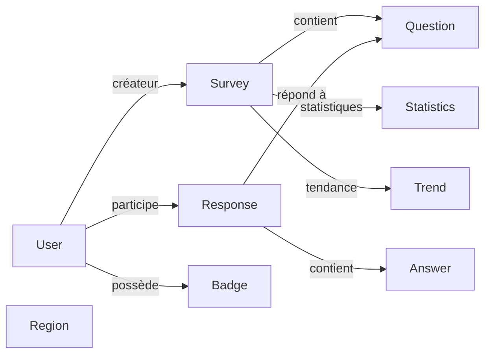

# 🗂️ Structure complète GabStatPulse

```
GabStatPulse/
│
├── 📄 Configuration Files
│   ├── next.config.ts              ✨ Configuration Next.js 15
│   ├── tsconfig.json               📘 Configuration TypeScript strict
│   ├── tailwind.config.ts          🎨 Thème Tailwind personnalisé
│   ├── postcss.config.js           🔧 Post-processing CSS
│   ├── vercel.json                 🚀 Configuration Vercel
│   ├── .eslintrc.json              ✅ Linting rules
│   ├── .gitignore                  🚫 Fichiers ignorés
│   ├── package.json                📦 Dépendances
│   ├── package-lock.json           🔒 Versions verrouillées
│   ├── .env.example                🔐 Variables template
│   ├── .env.local                  🔐 Variables locales
│   ├── auth.config.ts              🔑 Configuration NextAuth
│   ├── auth.ts                     🔑 Handlers NextAuth
│   └── middleware.ts               🛡️ Middleware d'authentification
│
├── 📁 Public Assets
│   └── public/                     📸 Images et fichiers statiques
│
├── 🎨 Styles & CSS
│   └── styles/
│       └── globals.css             💅 Styles globaux + animations
│
├── 🏗️ App Directory (Next.js 15)
│   └── app/
│       ├── layout.tsx              📐 Layout root
│       ├── page.tsx                🏠 Accueil (hero + stats)
│       │
│       ├── 🔐 auth/
│       │   ├── signin/
│       │   │   └── page.tsx        🔑 Page connexion
│       │   └── signup/
│       │       └── page.tsx        ✍️ Page inscription
│       │
│       ├── 📋 surveys/
│       │   ├── page.tsx            📝 Liste sondages + filtres
│       │   ├── [id]/
│       │   │   ├── page.tsx        📊 Détails + participation
│       │   │   ├── statistics/
│       │   │   │   └── route.ts    📈 API statistiques
│       │   │   └── analytics/
│       │   │       └── page.tsx    📉 Analyse détaillée
│       │   └── route.ts            🔗 API CRUD sondages
│       │
│       ├── 📊 dashboard/
│       │   └── page.tsx            📈 Tableau de bord (graphiques)
│       │
│       ├── 👤 profile/
│       │   └── page.tsx            👥 Profil utilisateur + badges
│       │
│       ├── ⚙️ admin/
│       │   └── page.tsx            🛠️ Panel administrateur
│       │
│       └── 🔗 api/
│           ├── surveys/
│           │   ├── route.ts        ✅ GET/POST sondages
│           │   └── [id]/
│           │       ├── route.ts    ✅ GET/POST sondage + réponses
│           │       └── statistics/
│           │           └── route.ts ✅ Statistiques
│           │
│           ├── auth/
│           │   ├── signup/
│           │   │   └── route.ts    ✅ Inscription utilisateurs
│           │   └── [...nextauth]/
│           │       └── route.ts    ✅ Handlers NextAuth
│           │
│           ├── trends/
│           │   └── route.ts        ✅ Calcul tendances
│           │
│           └── stats/
│               └── route.ts        ✅ Statistiques globales
│
├── 🧩 Components Directory
│   └── components/
│       │
│       ├── 🎨 ui/
│       │   ├── button.tsx          🔘 Boutons (4 variants)
│       │   ├── input.tsx           ✏️ Champs input
│       │   ├── card.tsx            📦 Cartes/conteneurs
│       │   ├── label.tsx           📝 Labels de formulaire
│       │   └── dialog.tsx          💬 Modales/dialogs
│       │
│       ├── 📊 charts/
│       │   └── index.tsx           📈 Graphiques (Bar/Line/Pie)
│       │
│       ├── 🗺️ maps/
│       │   └── gabon-map.tsx       🇬🇦 Carte interactive Gabon
│       │
│       ├── navbar.tsx              🧭 Barre de navigation
│       └── footer.tsx              🔗 Pied de page
│
├── 📚 Library & Utilities
│   └── lib/
│       ├── prisma.ts               🗄️ Client Prisma singleton
│       ├── utils.ts                🔧 Utilitaires (formatage, etc)
│       ├── trends.ts               📈 Algorithme tendances
│       └── [utils].ts              ✨ Utilitaires supplémentaires
│
├── 🎣 Custom Hooks
│   └── hooks/
│       ├── useFetch.ts             📡 Hook fetch personnalisé
│       └── [other-hooks].ts        🪝 Autres hooks
│
├── 📘 TypeScript Types
│   └── types/
│       └── index.ts                📋 Déclarations TypeScript
│
├── 🗄️ Database & ORM
│   └── prisma/
│       ├── schema.prisma           📐 Schéma BD complet (10 modèles)
│       ├── seed.js                 🌱 Données de test réalistes
│       └── migrations/             📊 Historique migrations
│
├── 🔧 Scripts
│   └── scripts/
│       └── verify-config.js        ✅ Vérification configuration
│
├── 📖 Documentation
│   ├── README.md                   📚 Vue d'ensemble complète
│   ├── INSTALLATION.md             💾 Guide installation (9 sections)
│   ├── DEPLOYMENT.md               🚀 Guide Vercel (8 sections)
│   ├── SUMMARY.md                  📋 Architecture complète
│   └── FILE_STRUCTURE.md           🗂️ Ce fichier
│
└── 🎯 Root Files
    ├── .next/                      ⚡ Build folder (dev)
    ├── node_modules/               📦 Dépendances
    ├── .git/                       📝 Historique Git
    └── dist/                       🏗️ Build folder (prod)
```

---

## 📊 Statistiques

| Catégorie | Nombre |
|-----------|--------|
| **Pages TSX** | 12 |
| **API Routes** | 8 |
| **Composants** | 20+ |
| **Fichiers UI** | 5 |
| **Fichiers Config** | 15+ |
| **Documents** | 4 |
| **Modèles Prisma** | 10 |
| **Régions** | 8 |
| **Badges** | 6 |
| **Catégories sondage** | 10+ |
| **Lignes TypeScript** | 3000+ |
| **Lignes CSS** | 500+ |
| **Lignes SQL/Prisma** | 200+ |

---

## 🎯 Hiérarchie des répertoires principaux

```
GabStatPulse/ (Racine)
│
├── app/                ← Next.js App Router (Pages + API)
├── components/         ← Composants React réutilisables
├── lib/               ← Logique métier & utilitaires
├── hooks/             ← React Hooks personnalisés
├── types/             ← Types TypeScript globaux
├── styles/            ← CSS global
├── prisma/            ← ORM & Base de données
├── public/            ← Assets statiques
└── scripts/           ← Scripts utilitaires
```

---

## 🔗 Routes principales

### Pages publiques
- `/` - Accueil
- `/surveys` - Liste des sondages
- `/surveys/[id]` - Participation sondage
- `/auth/signin` - Connexion
- `/auth/signup` - Inscription

### Pages protégées (Auth requise)
- `/dashboard` - Tableau de bord
- `/profile` - Profil utilisateur
- `/admin` - Panel administrateur
- `/surveys/[id]/analytics` - Analyse détaillée

### Endpoints API
- `GET/POST /api/surveys` - Gestion sondages
- `GET/POST /api/surveys/[id]` - Détails + réponses
- `GET /api/surveys/[id]/statistics` - Statistiques
- `GET /api/trends` - Tendances
- `GET /api/stats` - Stats globales
- `POST /api/auth/signup` - Inscription
- `GET/POST /api/auth/[...nextauth]` - Auth handlers

---

## 🗄️ Modèles Prisma



---

## ✨ Stack Technologique

```
Frontend:
├── Next.js 15
├── React 19
├── TypeScript 5.3
├── Tailwind CSS 3.4
├── Shadcn UI
├── Framer Motion
├── Recharts
└── React Hook Form

Backend:
├── Next.js API Routes
├── NextAuth v5
├── Prisma ORM
└── PostgreSQL

Déploiement:
├── Vercel
├── PostgreSQL Cloud
└── Cloudinary (Images)

Développement:
├── ESLint
├── Prettier
└── TypeScript
```

---

## 🚀 Commandes disponibles

Depuis la racine du projet:

```bash
# Démarrage
npm run dev              # Dev server avec hot-reload
npm run build            # Build production
npm start                # Production server

# Database
npx prisma generate     # Générer client
npx prisma migrate dev  # Migrations
npx prisma studio      # Interface graphique
npm run db:seed         # Données de test

# Vérification
npm run lint            # ESLint check
node scripts/verify-config.js  # Vérifier config
```

---

## 📦 Taille des fichiers (estimé)

| Dossier | Taille |
|---------|--------|
| node_modules/ | ~400 MB (non inclus) |
| .next/ | ~50 MB (build) |
| app/ | ~200 KB |
| components/ | ~150 KB |
| lib/ | ~50 KB |
| styles/ | ~15 KB |
| prisma/ | ~30 KB |

---

## 🔐 Fichiers sensibles (gitignored)

```
.env.local              # Variables locales
node_modules/           # Dépendances
.next/                  # Build Next.js
dist/                   # Build prod
.DS_Store               # macOS
*.log                   # Logs
```

---

## ✅ Checklist fichiers essentiels

Vérifier la présence de:

- [ ] `package.json` - Dépendances
- [ ] `tsconfig.json` - TypeScript
- [ ] `next.config.ts` - Config Next.js
- [ ] `auth.config.ts` - Auth
- [ ] `prisma/schema.prisma` - BD
- [ ] `.env.local` - Variables
- [ ] `app/layout.tsx` - Root layout
- [ ] `components/ui/` - Composants
- [ ] `lib/prisma.ts` - Client Prisma
- [ ] `README.md` - Documentation

---

## 🎯 Navigation rapide

**Pour ajouter une nouvelle page:**
```
app/ma-page/page.tsx
```

**Pour ajouter une API Route:**
```
app/api/ma-route/route.ts
```

**Pour ajouter un composant:**
```
components/mon-composant.tsx
```

**Pour ajouter un hook:**
```
hooks/useMonHook.ts
```

---

**Structure prête pour la production ! 🚀**

Pour plus d'infos: Voir [README.md](README.md), [INSTALLATION.md](INSTALLATION.md), [DEPLOYMENT.md](DEPLOYMENT.md)
